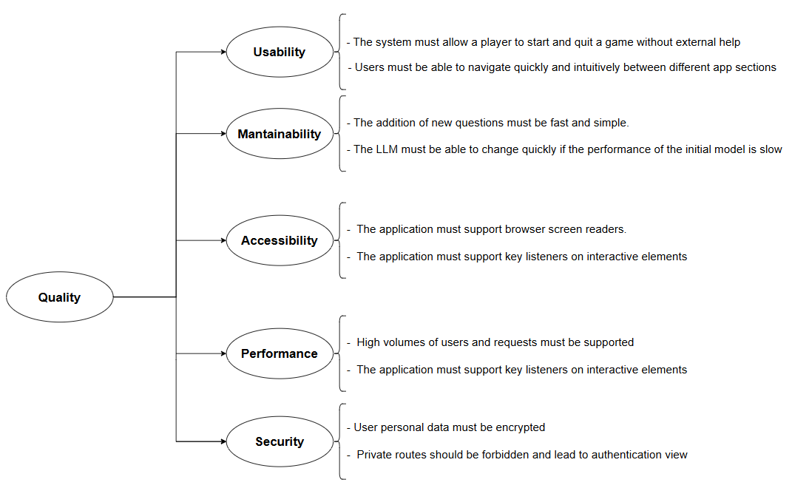

ifndef::imagesdir[:imagesdir: ../images]

[[section-quality-scenarios]]
== Quality Requirements
In order to make Wichat a satisfactory final product, we find it crucial to set some quality requirements to live up with. These aspects are to influence architectural decisions and hence include some measurable features:

- **Usability:** Intuitive and easy interfaces, reducing the volume of help needed in order to use the application.
- **Mantainability:** Long-term enhancement support requiring minimal effort.
- **Accesibility:** Make the application usable to people with diverse disabilities.

Moreover, some other non-functional requirements, while less prioritary, are still relevant:

- **Performance:** A smooth user experience, ensuring responsiveness and minimal delays.
- **Security:** Basic measures, even if sensitive data is not handled.

=== Quality Tree

=== Quality Scenarios
[cols="3,3,5,2"]
|===
|**ID** | **QA** | **Scenario** | **Priority**
| Q1.1 | Usability | The system must allow a player to start and quit a game without external help, within 3 minutes of opening the app, thanks to clear and simple interfaces. | High
| Q1.2 | Usability | Users must be able to navigate between different app sections (ranking, profile, game, API, etc.) in no more than 2 taps. It should take under 10 seconds for an average user. | High
| Q2.1 | Maintainability | The addition of new questions must be quick and simple. It should take approximately 15 minutes | High
| Q2.2 | Maintainability | The system must allow the implementation of new game models with minimal changes to the existing codebase, which should not take more than 1 hour. There should not be any regression in existing game functionality. | Low
| Q3.1 | Accessibility | The product must provide key listeners in every interactive element in the application. It must not take more than 30 seconds for an average user to find and use an interactive element in the website| High
| Q3.2 | Accessibility | The application must support screen readers for users with visual impairments, guaranteeing as well buttons and answers that are simple to read. All interactive elements must have alternative text, and the screen reader should process the entire game in under 1 minute for each screen. | High
| P1.1 | Performance | The product must respond to a player's request in less than 1s. | High
| P1.2 | Performance | The application should give support to approximately 100 simultaneous request without significant downgrade in performance | Medium
| S1.1 | Security | It must be ensured that player personal data (especially credentials) is encrypted, even if no sensitive data is handled. 0 data breaches must be admitted | Medium
| S1.2 | Security | The system must support private routes, which will lead to the authentication view in case of unauthorized access 100% of unauthorized access attempts must be blocked and logged.| Medium
| S1.3 | Security | The system must log all user actions related to account creation and gameplay. Logs must be stored securely and retrievable within 5 seconds. | Low
|===
